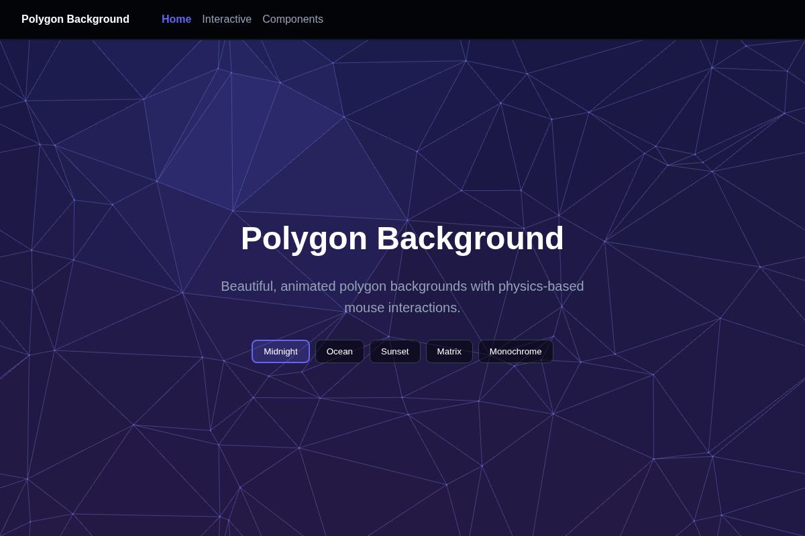
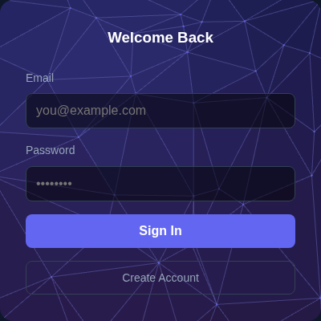
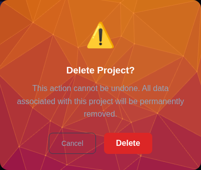

# Polygon Background

Beautiful, animated polygon backgrounds for web applications. Built with WebGL and WebAssembly for smooth 60fps performance.



## Features

- **WebGL Rendering** - Hardware-accelerated graphics for smooth animations
- **WASM Acceleration** - WebAssembly-powered physics simulation
- **5 Built-in Themes** - midnight, ocean, sunset, matrix, monochrome
- **Interactive Physics** - Push, pull, and swirl effects with spring physics
- **Click Shockwaves** - Expanding wave effects on click
- **Gravity Wells** - Hold to attract or repel points
- **Smooth Transitions** - Animated theme switching
- **TypeScript Support** - Full type definitions included
- **Framework Agnostic** - Works with React, Vue, Angular, or vanilla JS

## Installation

```bash
npm install polygon-background
```

## Quick Start

```html
<div id="background" style="width: 100%; height: 100vh;"></div>

<script type="module">
  import { PolygonBackground } from 'polygon-background';

  const bg = new PolygonBackground(document.getElementById('background'), {
    theme: 'midnight',
    pointCount: 80,
  });
</script>
```

## Framework Examples

### React

```tsx
import { useRef, useEffect } from 'react';
import { PolygonBackground } from 'polygon-background';

function App() {
  const containerRef = useRef<HTMLDivElement>(null);

  useEffect(() => {
    if (!containerRef.current) return;
    const bg = new PolygonBackground(containerRef.current, {
      theme: 'midnight',
      pointCount: 80,
    });
    return () => bg.destroy();
  }, []);

  return <div ref={containerRef} style={{ width: '100%', height: '100vh' }} />;
}
```

### Vue

```vue
<script setup lang="ts">
import { ref, onMounted, onUnmounted } from 'vue';
import { PolygonBackground } from 'polygon-background';

const containerRef = ref<HTMLDivElement>();
let bg: PolygonBackground | null = null;

onMounted(() => {
  if (containerRef.value) {
    bg = new PolygonBackground(containerRef.value, {
      theme: 'midnight',
      pointCount: 80,
    });
  }
});

onUnmounted(() => bg?.destroy());
</script>

<template>
  <div ref="containerRef" style="width: 100%; height: 100vh" />
</template>
```

### Angular

```typescript
import { Component, ElementRef, ViewChild, AfterViewInit, OnDestroy } from '@angular/core';
import { PolygonBackground } from 'polygon-background';

@Component({
  selector: 'app-background',
  standalone: true,
  template: `<div #container style="width: 100%; height: 100vh"></div>`,
})
export class BackgroundComponent implements AfterViewInit, OnDestroy {
  @ViewChild('container') containerRef!: ElementRef<HTMLDivElement>;
  private bg: PolygonBackground | null = null;

  ngAfterViewInit() {
    this.bg = new PolygonBackground(this.containerRef.nativeElement, {
      theme: 'midnight',
      pointCount: 80,
    });
  }

  ngOnDestroy() {
    this.bg?.destroy();
  }
}
```

See `examples/` for complete working demos with theme switching and interactive physics.

## Component Examples

The library can be used to create stunning backgrounds for any UI component:

### Login Card


### Toolbar


### Dialog


## Configuration

```typescript
const bg = new PolygonBackground(container, {
  // Theme
  theme: 'midnight', // 'midnight' | 'ocean' | 'sunset' | 'matrix' | 'monochrome'

  // Points
  pointCount: 80,
  pointSize: 2,

  // Animation
  speed: 1,

  // Lighting
  light: {
    mode: 'fixed', // 'fixed' | 'mouse'
    position: { x: 0.3, y: 0.2 },
  },

  // Mouse interaction
  mouse: {
    enabled: true,
    radius: 200,
    radiusUnit: 'px',
    strength: 80,           // displacement strength (0-150)
    mode: 'push',           // 'push' | 'pull' | 'swirl'
    springBack: 0.08,       // how fast points return (0-1)
    velocityInfluence: 0.5, // mouse speed effect (0-1)
  },

  // Click/hold interactions
  interaction: {
    clickShockwave: true,     // trigger shockwave on click
    holdGravityWell: true,    // create gravity well on hold
    gravityWellAttract: false, // attract (true) or repel (false)
  },

  // Height/topography (static, for lighting variation)
  height: {
    noiseScale: 0.003,
    intensity: 0.6,
    centerFalloff: 0.3,
  },

  // Theme transitions
  transition: {
    enabled: true,
    duration: 1000,
  },

  // Performance
  performance: {
    targetFPS: 0, // 0 = unlimited
    showFPS: false,
  },
});
```

## API

### Instance Methods

```typescript
// Lifecycle
bg.start();
bg.stop();
bg.pause();
bg.resume();
bg.destroy();

// State
bg.isPaused();
bg.isRunning();
bg.getFPS();

// Theme
bg.setTheme('ocean');
bg.getTheme();

// Configuration
bg.setOption('pointCount', 100);
bg.getOption('pointCount');
bg.setLightConfig({ mode: 'mouse' });
bg.setMouseConfig({ mode: 'swirl', strength: 100 });
bg.setInteractionConfig({ clickShockwave: false });
bg.setHeightConfig({ intensity: 0.8 });

// Interactive effects
bg.triggerShockwave(x?, y?);  // trigger shockwave at position (default: center)
bg.setGravityWell(x, y, active, attract?);  // control gravity well
```

### Available Themes

| Theme | Description |
|-------|-------------|
| `midnight` | Deep blue/purple with indigo highlights (default) |
| `ocean` | Cyan blues with deep sea colors |
| `sunset` | Orange/coral with magenta accents |
| `matrix` | Bright green digital aesthetic |
| `monochrome` | Elegant grayscale |

### Custom Themes

#### Option 1: Extend an existing theme

```typescript
import { PolygonBackground, createTheme } from 'polygon-background';

// Create a custom theme based on midnight
const myTheme = createTheme('midnight', {
  gradientStart: '#ff0066',
  gradientEnd: '#6600ff',
  backgroundColor: '#0a0010',
  lightColor: '#ff66aa',
  pointColor: 'rgba(255, 102, 170, 0.6)',
});

const bg = new PolygonBackground(container, {
  theme: myTheme,
});
```

#### Option 2: Create a full theme from scratch

```typescript
import { PolygonBackground, ThemeDefinition } from 'polygon-background';

const customTheme: ThemeDefinition = {
  name: 'Neon',
  gradientStart: '#00ffff',
  gradientEnd: '#ff00ff',
  backgroundColor: '#000011',
  strokeColor: 'rgba(0, 255, 255, 0.3)',
  strokeWidth: 0.5,
  lightColor: '#00ffff',
  shadowColor: '#110022',
  lightPosition: { x: 0.5, y: 0.2 },
  shadowIntensity: 0.7,
  highlightIntensity: 0.6,
  ambientLight: 0.2,
  pointColor: 'rgba(0, 255, 255, 0.5)',
  pointSize: 1.5,
  fillOpacity: 0.85,
};

const bg = new PolygonBackground(container, {
  theme: customTheme,
});
```

#### Theme Properties

| Property | Type | Description |
|----------|------|-------------|
| `name` | string | Display name |
| `gradientStart` | string | Top/left gradient color |
| `gradientEnd` | string | Bottom/right gradient color |
| `backgroundColor` | string | Canvas background |
| `strokeColor` | string | Line color (with opacity) |
| `strokeWidth` | number | Line thickness |
| `lightColor` | string | Highlight color |
| `shadowColor` | string | Shadow color |
| `lightPosition` | {x, y} | Light source (0-1 normalized) |
| `shadowIntensity` | number | Shadow strength (0-1) |
| `highlightIntensity` | number | Highlight strength (0-1) |
| `ambientLight` | number | Minimum brightness (0-1) |
| `pointColor` | string | Vertex dot color |
| `pointSize` | number | Vertex dot size |
| `fillOpacity` | number | Triangle fill opacity (0-1) |

## Development

### Prerequisites

- Node.js 18+
- npm 9+
- Rust (for WASM development)

### Setup

```bash
# Install dependencies
npm install

# Start development server
npm run dev

# Build for production
npm run build
```

### Running Examples

```bash
# Link the library globally
npm link

# Run React example
cd examples/react && npm install && npm link polygon-background && npm run dev

# Run Vue example
cd examples/vue && npm install && npm link polygon-background && npm run dev

# Run Angular example
cd examples/angular && npm install && npm link polygon-background && npm run dev
```

## Browser Support

- Chrome 90+
- Firefox 90+
- Safari 15+
- Edge 90+

Requires WebGL 2.0 and WebAssembly support.

## License

MIT
